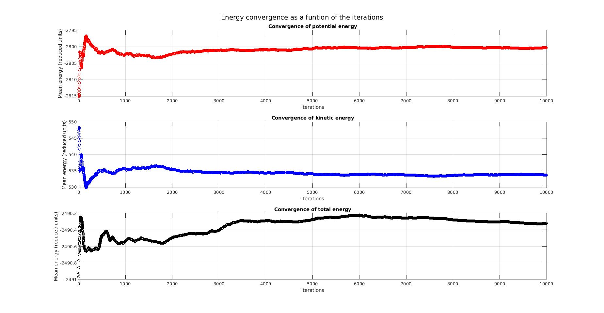

# MD-for-LJ-liquid-Argon

This program simulates liquid Argon using a Leonard JOnes (LJ) potential and allows to calculate the radial distribution function (RDF), the pressure and the energy.

Moreover it incorporates a refinement of the employed Boundary Conditions which allow to calculate the velocity autocorrelation function (VACF) and the mean square displancement (MSD), providing insights into the system dynamics.

## Example of the Energy conversion over the iterations

The following plot shows the convergence of the different energy contributions as a function of the simulation length, as an example of some of the results that can be obtained by performing such a MD simulation.

## Comments on use

To run the code make sure you download the the two files "leap-conf.data" & "leap-lj.data" and save them on the same folder as the ".f" file. The leap-lj.data file contains physical values for the simulation of liquid Argon and technical parameters that are useful to run the code, namely Nconf which can be adjusted to lower values when modyfying the code to see whether the new implementations are correct. (Don't forget to set it back to a big enough value to get illustrative results).

Moreover, the file leap-conf.data contains the initial conditions for the positions and velocities of the n atoms.
